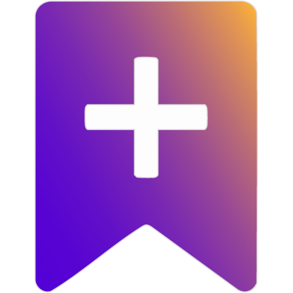

<div align="center">
  
  
  # 📚 Bookmark+
  
  <p align="center">
    <strong>Enhanced bookmark management with intelligent tagging and lightning-fast search</strong>
  </p>
  
  <p align="center">
    <a href="#features">Features</a> •
    <a href="#installation">Installation</a> •
    <a href="#development">Development</a> •
    <a href="#contributing">Contributing</a> •
    <a href="#license">License</a>
  </p>

  <p align="center">
    
    
    
  </p>
  
  <p align="center">
    
    
    
    
  </p>
  
  <p align="center">
    
    
    
    
  </p>
</div>

---

## ✨ Features

<table>
<tr>
<td width="50%">

### 🚀 **Core Features**
- 📚 **Smart Bookmark Management** - Organize your bookmarks intelligently
- 🏷️ **Advanced Tagging System** - Flexible tag-based organization
- 🔍 **Lightning Search** - Find bookmarks instantly with advanced filters
- ⚡ **Fast Performance** - Optimized React + TypeScript architecture
- 🎨 **Beautiful UI** - Modern, responsive design with SASS styling

</td>
<td width="50%">

### 🌐 **Cross-Platform**
- 🔵 **Chrome Extensions** - Full Chrome Web Store support
- 🦊 **Firefox Add-ons** - Complete Firefox compatibility  
- 🔴 **Opera Extensions** - Native Opera integration
- 🔷 **Edge Extensions** - Microsoft Edge support
- 🔄 **Unified Codebase** - One source for all browsers

</td>
</tr>
</table>

## 🚀 Quick Start

### Prerequisites

<p align="left">
  
  
  
</p>

### Installation

```bash
# Clone the repository
git clone https://github.com/your-username/bookmark-plus.git
cd bookmark-plus

# Install dependencies
npm install
# or
yarn install
```

### Development

```bash
# Development mode with hot reload
npm run dev:chrome    # 🔵 Chrome
npm run dev:firefox   # 🦊 Firefox  
npm run dev:opera     # 🔴 Opera

# Production build
npm run build         # 🚀 All browsers
npm run build:chrome  # 🔵 Chrome only
```

### Browser Installation

<details>
<summary><strong>🔵 Chrome Installation</strong></summary>

1. Open `chrome://extensions/`
2. Enable **Developer mode** (top-right toggle)
3. Click **Load unpacked**
4. Select the `extension/chrome` folder
5. 🎉 Ready to use!

</details>

<details>
<summary><strong>🦊 Firefox Installation</strong></summary>

1. Open `about:debugging`
2. Click **This Firefox**
3. Click **Load Temporary Add-on**
4. Select `manifest.json` in `extension/firefox`
5. 🎉 Ready to use!

</details>

<details>
<summary><strong>🔴 Opera Installation</strong></summary>

1. Open `opera:extensions`
2. Enable **Developer mode**
3. Click **Load unpacked**
4. Select the `extension/opera` folder
5. 🎉 Ready to use!

</details>

## 🏗️ Architecture

### Tech Stack

<div align="center">
  <table>
    <tr>
      <td align="center" width="96">
        
        <br>React
      </td>
      <td align="center" width="96">
        
        <br>TypeScript
      </td>
      <td align="center" width="96">
        
        <br>Webpack
      </td>
      <td align="center" width="96">
        
        <br>Sass
      </td>
      <td align="center" width="96">
        
        <br>Babel
      </td>
      <td align="center" width="96">
        
        <br>ESLint
      </td>
    </tr>
  </table>
</div>

### Project Structure

```
📦 bookmark-plus/
├── 📂 source/                    # 🎯 TypeScript + React source
│   ├── 📂 Background/            # 🔧 Background scripts
│   ├── 📂 ContentScript/         # 📄 Content scripts  
│   ├── 📂 Popup/                 # 🖼️ Extension popup
│   ├── 📂 Options/               # ⚙️ Options page
│   ├── 📂 components/            # 🧩 Reusable components
│   ├── 📂 services/              # 🛠️ Business logic
│   └── 📄 manifest.json          # 📋 Extension manifest
├── 📂 views/                     # 🌐 HTML templates
├── 📂 extension/                 # 📦 Built extensions
│   ├── 📂 chrome/               # 🔵 Chrome build
│   ├── 📂 firefox/              # 🦊 Firefox build
│   └── 📂 opera/                # 🔴 Opera build
├── 📄 webpack.config.js         # ⚡ Build configuration
└── 📄 package.json              # 📋 Project metadata
```

## 🔧 Development Scripts

| Command | Description | Usage |
|---------|-------------|-------|
| `npm run dev:chrome` | 🔵 Chrome development with hot reload | Daily development |
| `npm run dev:firefox` | 🦊 Firefox development with hot reload | Firefox testing |
| `npm run dev:opera` | 🔴 Opera development with hot reload | Opera testing |
| `npm run build` | 🚀 Production build for all browsers | Release preparation |
| `npm run lint` | 🔍 Code quality check | Pre-commit hook |
| `npm run lint:fix` | 🔧 Auto-fix linting issues | Code cleanup |

## 🤝 Contributing

We love contributions! Here's how you can help make Bookmark+ even better:

<div align="center">
  <table>
    <tr>
      <td align="center">
        
      </td>
      <td align="center">
        
      </td>
      <td align="center">
        
      </td>
    </tr>
  </table>
</div>

1. 🍴 **Fork** the repository
2. 🌿 **Create** your feature branch (`git checkout -b feature/amazing-feature`)
3. 💻 **Commit** your changes (`git commit -m 'Add amazing feature'`)
4. 🚀 **Push** to the branch (`git push origin feature/amazing-feature`)
5. 🎯 **Open** a Pull Request

## 🙏 Acknowledgments

<div align="center">
  <p>Built with 💜 using the excellent <a href="https://github.com/abhijithvijayan/web-extension-starter">web-extension-starter</a> boilerplate</p>
  <p>Special thanks to <a href="https://github.com/abhijithvijayan">@abhijithvijayan</a> for the amazing foundation!</p>
</div>

---

<div align="center">
  
  ## 📄 License
  
  <p>
    <strong>MIT License</strong> © 2024 <a href="https://zerobell.xyz">Bookmark+</a>
  </p>
  
  <p>
    <a href="./LICENSE">
      
    </a>
  </p>
  
  ---
  
  <p>
    <strong>Made with ❤️ for the developer community</strong>
  </p>
  
  <p>
    <a href="https://www.buymeacoffee.com/zerobell">
      
    </a>
  </p>
  
  <p>
    <a href="mailto:lee@zerobell.xyz">📧 Contact</a> •
    <a href="https://zerobell.xyz">🌐 Website</a>
  </p>
  
</div>